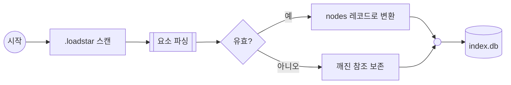

# 부록 — Flow (FLOW)

> 공통 규칙은 `02.ELEMENT_FORMAT.md` 참조.

## 목적

업무·처리의 **흐름**을 한 장의 그림으로 기술한다. 프로젝트 전체 흐름을 담는 것이 주 용도이고, 한 단계가 복잡하면 그 단계를 별도 FLOW로 풀어 쓴다 — 단계 하나는 원자적 작업이거나 다른 흐름들의 합성이다.

WP가 "무엇을 할 것인가"(작업 단위)라면, FLOW는 "그 작업들이 어떤 순서·갈래로 이어지는가"(연결)다. 같은 WP가 여러 흐름에 등장할 수 있고, 어떤 흐름에도 등장하지 않아도 된다.

## 고유 슬롯

| 슬롯 | 값 | 비고 |
|:--|:--|:--|
| `DIAGRAM` | ```` ```mermaid ```` 코드블록 하나 | 순수 mermaid flowchart. 그림의 원본 |
| `REFERENCES` | `노드id: 요소 파일명` 리스트 (선택) | 그 노드가 가리키는 WP/DWP/FLOW/OTHER |

STATUS·GOAL·TODO는 갖지 않는다 — 작업 단위가 아니다.

## 포맷

````
### IDENTITY
- SUMMARY: 이 흐름이 무엇을 기술하는가

### CONNECTIONS
- PARENT: 상위 요소 파일명 (없으면 이 줄 자체를 생략). GROUP은 여기 기술하지 않는다 — 소속은 GROUP 쪽에서만 관리(`appendix/GROUP.md`).
- REFERENCE: 참조 관계 파일명 리스트

### DIAGRAM


### REFERENCES
- scan: [WP][2.0][2026.07.27]구조 추출기.md
- parse: [FLOW][2.0][2026.09.17]요소 파싱 상세.md
- db: [DWP][2.0][2026.08.13]구조 추출기 nodes 테이블.md

### ISSUE
- 설계 시점 제약이나 미결 사항을 자유 형식으로 기술한다.
````

## 노드 팔레트

mermaid **도형이 곧 노드 종류**다. 파일에 종류를 따로 선언하지 않는다 — 선언을 두면 도형과 선언이 어긋날 수 있고, 그림만 봐도 읽히는 것이 낫다.

| 종류 | 의미 | 표기 | 참조 대상 |
|:--|:--|:--|:--|
| **step** | 하나의 작업 단계 | `id[라벨]` | WP |
| **branch** | 조건에 따라 갈래가 나뉨 | `id{라벨}` + 화살표 라벨 | — |
| **merge** | 여러 갈래가 하나로 합쳐짐 | `id(( ))` | — |
| **subflow** | 다른 FLOW를 펼쳐 쓰는 단계 | `id[[라벨]]` | **FLOW** |
| **store** | 읽고 쓰는 데이터 | `id[(라벨)]` | **DWP** |
| **terminal** | 흐름의 시작·종료 | `id((라벨))` | — |

여섯 종류로 시작한다. `map`(1:1 변환), `filter`(선별), `external`(사람·외부 시스템) 같은 추가 종류는 실사용으로 필요성이 확인된 뒤에 표에 더한다 — 쓰이지 않을 종류를 미리 정의하지 않는다.

mermaid 자체 문법이므로 위 표에 없는 도형·방향(`flowchart TD` 등)·`subgraph`도 그릴 수 있다. 다만 표에 있는 여섯 종류는 **의미가 고정**이므로, 다른 뜻으로 쓰지 않는다.

## 참조 규칙

- `REFERENCES`의 키는 `DIAGRAM`에 나오는 mermaid 노드 id다. 값은 대상 **파일명**이며, FORMAT 접두어로 대상 폴더를 판단한다(`02.ELEMENT_FORMAT.md §4`).
- 값의 FORMAT이 `FLOW`이면 그 노드는 **하위 흐름**이다. 도구는 그 단계를 펼치거나 해당 FLOW로 이동할 수 있다.
- 모든 노드에 참조가 있을 필요는 없다. `branch`·`merge`·`terminal`처럼 제어만 담당하는 노드는 그림에만 존재한다.
- **노드 id는 영숫자·밑줄로 쓴다.** 참조의 키이자 도구가 그림 위에서 노드를 찾는 키이기 때문이다. 라벨(대괄호 안)은 한글·공백 등 자유 텍스트다.

## 주의

- **간선(`a --> b`)은 색인 대상이 아니다.** 구조 추출기는 코드블록 안을 읽지 않는다. 도구가 다루는 관계는 `CONNECTIONS`와 `REFERENCES`뿐이다. 그림의 위상은 사람이 보라고 있는 것이고, 기계가 질의할 관계는 `REFERENCES`에 있다.
- **FLOW끼리 서로를 참조하면 순환이 된다.** 하위 흐름 전개에는 깊이 상한이 필요하고, 검증 패스는 순환을 보고한다 — 금지하지는 않는다(되돌아가는 업무 흐름은 실재한다).
- 한 흐름이 지나치게 커지면 `subflow`로 쪼갠다. WP의 GOAL이 길어지면 하위 WP로 분해하라는 신호인 것과 같은 기준이다.
